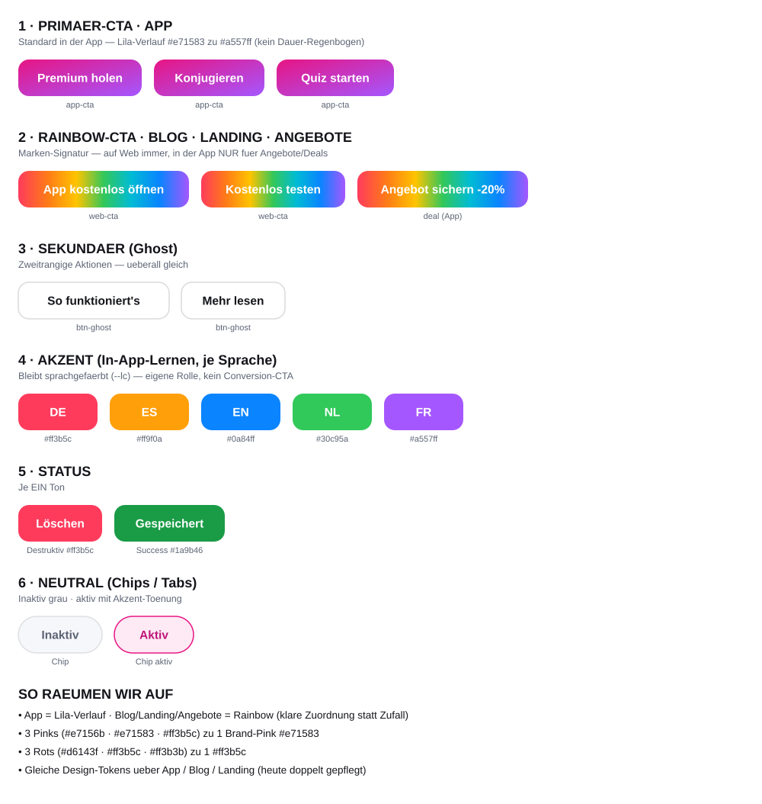

# ConjuExpert — Button- & CTA-System

Kanonische Referenz für **App, Blog, Landing** (und die Mails). Ziel: klare Rollen,
je Rolle **ein** Stil, eine bewusste Regel, wo welcher CTA gilt.

Stand: 2026-06-21. Status: abgenommen (Design), Umsetzung folgt Oberfläche für Oberfläche.

---

## Die Grundregel

| CTA-Look | Wo er gilt |
|---|---|
| **Lila-Verlauf** (`#e71583 → #a557ff`) | **App-Standard** — Konjugieren, Quiz, Premium, alle normalen Haupt-CTAs in der App |
| **Rainbow** (7-Farb-Verlauf) | **Blog & Landing immer** · in der **App nur für Angebote/Deals** |

Die App bleibt ruhig (Lila), das Web trägt die Marken-Signatur (Rainbow). Der Rainbow
taucht in der App nur dort auf, wo es um ein Angebot geht — als bewusster Eyecatcher.

---

## Rollen & Tokens

### 1. Primär-CTA — App (`--cta-app`)
- **Fläche:** `linear-gradient(135deg, #e71583, #a557ff)`
- **Text:** `#ffffff` · **Schatten:** `0 14px 30px -12px rgba(120,40,200,.5)`
- **Radius:** 14px · **Gewicht:** 700
- **Dark/Mono-Fallback:** `linear-gradient(135deg, #2b2f3a, #4a4f60)`
- **Einsatz:** Haupt-Aktion in der App (Konjugieren, Quiz starten, Premium holen, Login-Modal-CTA).

### 2. Rainbow-CTA — Web & Angebote (`--cta-rainbow`)
- **Fläche:** `linear-gradient(100deg, #ff3b5c, #ff7a18, #ffc400, #34c759, #00bcd4, #0a84ff, #a557ff)`
- **Text:** `#ffffff` · **Schatten:** `rgba(120,40,200,.5)` · **Radius:** 14px
- **Einsatz:** Blog- & Landing-Haupt-CTAs (App öffnen, Kostenlos testen) **und** Angebots-/Deal-CTAs in der App.

### 3. Sekundär / Ghost (`--btn-ghost`)
- **Fläche:** `var(--surface)` (hell `#ffffff`) · **Text:** `var(--text)` (`#14151a`)
- **Rand:** `1px solid var(--border)` · **Radius:** 14px
- Auf farbigem Band: Fläche `#fff`, Rand `#fff`.
- **Einsatz:** zweitrangige Aktionen („So funktioniert's", „Mehr lesen").

### 4. Akzent — In-App-Lernen (`--lc`, je Sprache)
Bewusst sprachgefärbt. **Eigene Rolle** — niemals als Conversion-CTA verwenden.
| Sprache | Farbe |
|---|---|
| DE | `#ff3b5c` |
| ES | `#ff9f0a` |
| EN | `#0a84ff` |
| NL | `#30c95a` |
| FR | `#a557ff` |
- **Text:** `#ffffff`. **Einsatz:** Quiz-Check/Next, Vokabel-Start/Plus, Mic, aktive Tabs/Sprach-Buttons, Fehler-Zähler.

### 5. Status
- **Destruktiv / Fehler / dringend (`--danger`):** `#ff3b5c` (Text `#fff`; als Textfarbe für Fehler/Preis ebenfalls `#ff3b5c`).
- **Erfolg (`--success`):** `#1a9b46`.

### 6. Neutral — Chips / Tabs / Filter
- **Inaktiv:** Fläche `var(--surface-2)`, Text `var(--muted)`, Rand `var(--border)`, Radius 999px.
- **Aktiv:** Fläche `color-mix(in srgb, <Akzent> 12%, var(--surface))`, Text/Rand in `<Akzent>`.
  (Akzent = Kontext: Sprachfarbe in der App, `#e71583`/`#ff9f0a` im Web-Filter.)

---

## Marken-Kernfarben (eine pro Bedeutung)

| Token | Hex | Bedeutung |
|---|---|---|
| `--brand-pink` | `#e71583` | Marke / Primär-CTA-Start / Login |
| `--brand-violet` | `#a557ff` | Marke / CTA-Ende / FR-Akzent |
| `--brand-blue` | `#0a84ff` | EN-Akzent / Sekundär-Verläufe / Focus |
| `--danger` | `#ff3b5c` | Fehler / Destruktiv / DE-Akzent |
| `--success` | `#1a9b46` | Erfolg |
| Rainbow-Stops | `#ff3b5c · #ff7a18 · #ffc400 · #34c759 · #00bcd4 · #0a84ff · #a557ff` | Marken-Signatur |

---

## Aufräumen (Konsolidierungen)

1. **Drei Pinks → ein Brand-Pink `#e71583`.** Ersetzt `#e7156b` (alter App-CTA-Start). `#ff3b5c` bleibt **nur** als `--danger`/DE-Akzent (nicht als „Pink").
2. **Drei Rots → ein `#ff3b5c`.** Ersetzt `#d6143f` (Preis) und `#ff3b3b` (Mic-Rec).
3. **Zwei konkurrierende Primär-CTAs → klare Zuordnung** (App=Lila, Web/Angebote=Rainbow) statt zufälligem Mix.
4. **Eigener Lila-Verlauf von `.learn-blog-btn`** (`#7c3aed→#c06bff`) → ersetzen durch `--cta-app` (oder `--cta-rainbow`, da Blog-Verweis).
5. **Doppelte Token-Pflege vereinheitlichen:** App nutzt `--text/--surface-2/--muted/--lc`, Web `--ink/--vivid`. Künftig **ein** Namensset über alle Oberflächen.
6. **Radius vereinheitlichen:** Buttons 14px, Pills/Badges/Chips 999px.

---

## Bestand → neue Rolle (Umsetzungs-Mapping)

| Bestehende Klasse(n) | Datei | Neue Rolle |
|---|---|---|
| `.cta`/`.cta-rainbow`, `.namebtn`, `.plansel-cta` | index.html | **cta-app** (Lila) |
| `.gcta`, `.paysuc-cta`, Angebots-/Deal-CTAs | index.html | **cta-rainbow** (nur Angebot) |
| `.learn-blog-btn` | index.html | cta-app (oder cta-rainbow, da Blog-Link) |
| `.quizbtn.check/next`, `.vocstart`, `.vocaddbtn`, `.micbtn`, `.mistbtn-n` | index.html | **Akzent** (`--lc`) |
| `.btn-primary` | blog/blog.css, landing | **cta-rainbow** (bereits Rainbow) |
| `.btn-ghost` | blog/blog.css, landing | **Ghost** |
| `.langsw button.on`, `.plan-badge` | blog, landing | Sekundär-Verlauf `#0a84ff→#a557ff` (Badge/Toggle) |
| Preis `#d6143f`, Mic `#ff3b3b` | index.html | **danger** `#ff3b5c` |

---

## Umsetzungsplan (Oberfläche für Oberfläche, je eigener PR)

1. **Blog + Landing** (geringes Risiko, gemeinsames `.btn`-System): Tokens einführen, `#e7156b`→`#e71583` falls vorhanden, Token-Namen angleichen. Visuell quasi unverändert.
2. **App** (größtes, vorsichtig): Tokens definieren, CTA-Mapping anwenden (Lila vs. Rainbow-für-Angebote), Pinks/Rots konsolidieren.
3. **Mails**: `--cta-app`/Rainbow-Logik übernehmen (Angebots-Mails = Rainbow, Auth = ruhig), zusammen mit Logo-Einbau.

Jeder Schritt einzeln getestet/abgenommen, damit nichts kippt.
